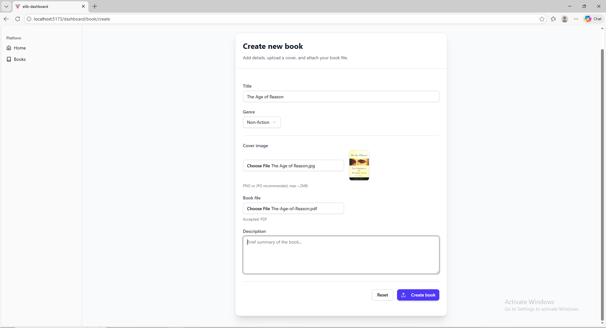

# 📚 Library Dashboard (Full‑Stack Project)
A full‑stack ebook management system with a React + Vite frontend and a Node.js + Express + MongoDB backend. This project allows users to manage ebooks, authenticate securely, and interact with a modern dashboard UI.

## 🚀 Project Structure
### elib-dashboard/
### ├── frontend/    React + Vite + Tailwind + shadcn/ui
### ├── backend/     Node.js + Express + MongoDB
### └── README.md    Main project overview

## 🛠️ Tech Stack
### Frontend: React, Vite, TailwindCSS, shadcn/ui, React Query
### Backend: Node.js, Express.js, MongoDB, JWT Authentication
### Deployment: Vercel (frontend), Render (backend)

## 📌 Features
### Authentication → Signup/Login with JWT tokens
### Dashboard → Stats, activity, and quick navigation
### CRUD Operations → Create, Read, Update, Delete ebooks
### Search & Filter → Find ebooks easily with filters and sorting
### File Uploads → Upload cover images and PDF files
### Responsive UI → Works across desktop and mobile

## ⚙️ Installation & Setup
### Frontend
#### cd frontend
#### npm install
#### npm run dev

### Backend
#### cd backend
#### npm install
#### npm start

### Environment Variables
### MONGO_CONNECTION_STRING=mongodb://localhost:27017/elibrary;
#### JWT_SECRET=kbksjgfjjsvgnjhs
#### PORT=5513

## 📂 API Endpoints (Backend)
### POST /api/auth/signup → Register new user
### POST /api/auth/login → Login user
### GET /api/books → Get all books
### POST /api/books → Add new book
### PUT /api/books/:id → Update book
### DELETE /api/books/:id → Delete book

## 🖼️ Screenshots
### 📊 Dashboard

### 🔑 Login Page

### 📚 Book List

### ➕ Create Book

### ✏️ Edit Book

### 📱 Signup Page

## Author
### Developed by Ankur Rahate

